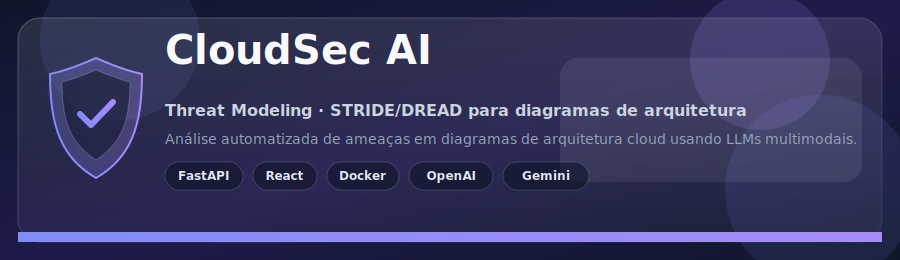
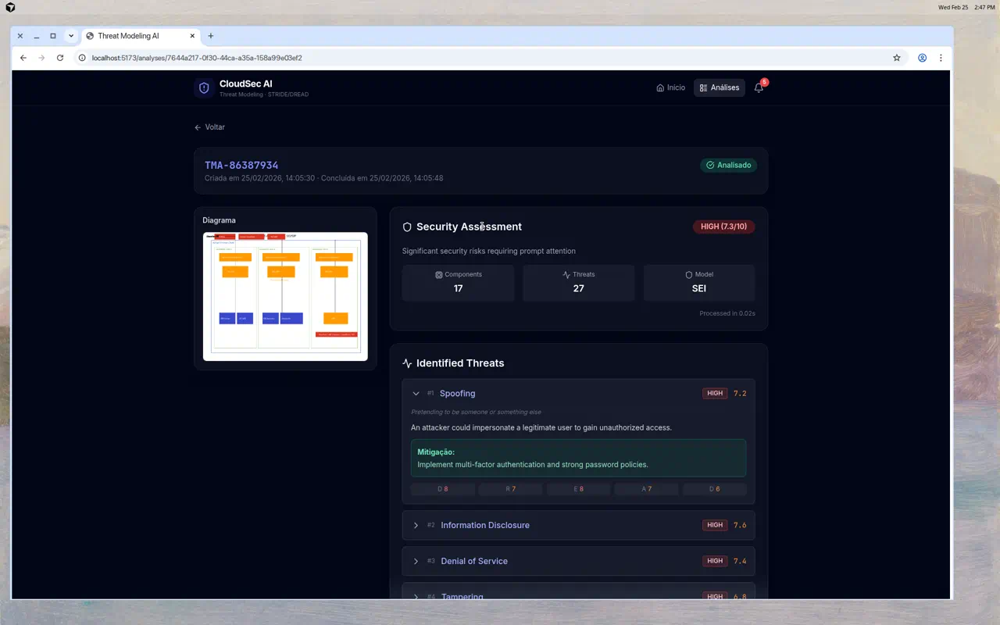
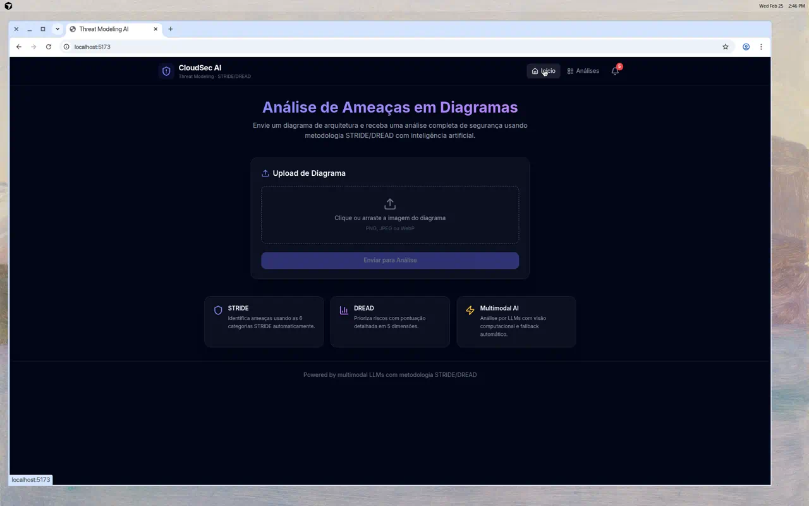
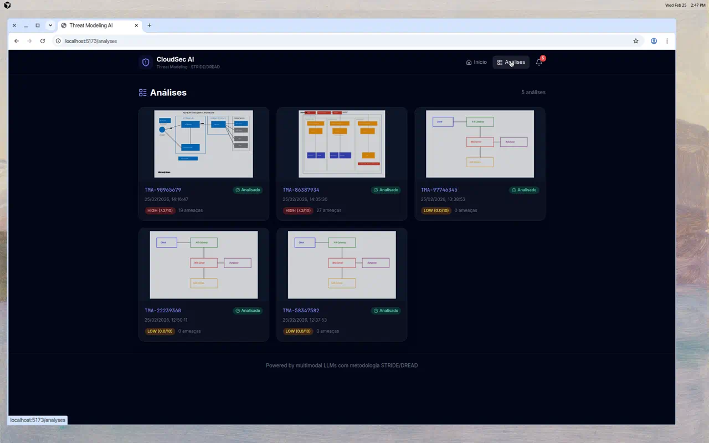
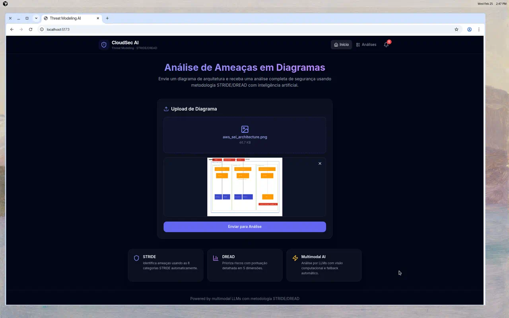
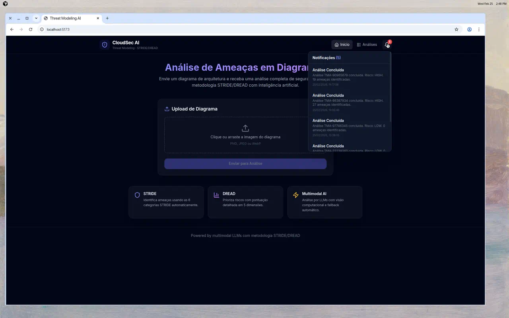
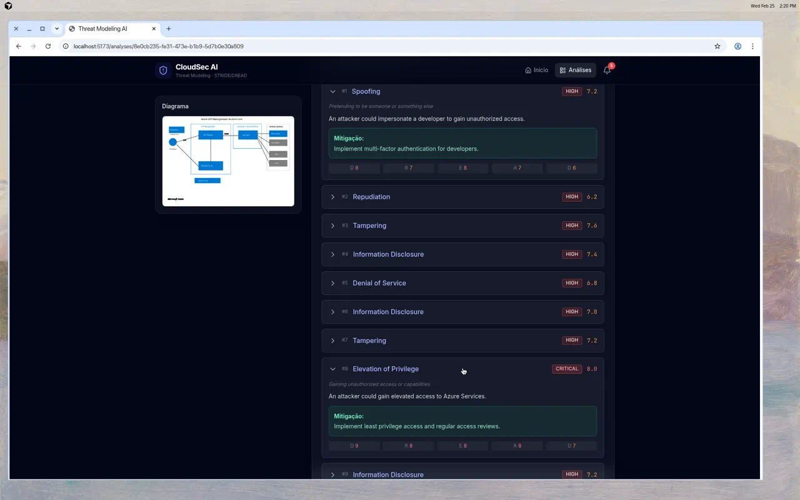
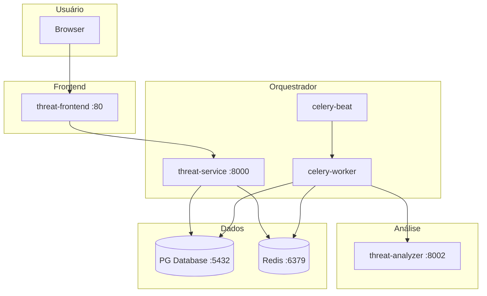

<p align="center">
  
</p>

<p align="center">
  
  
  
  
  
  
  
  
</p>

<p align="center">
  Análise automatizada de ameaças em diagramas de arquitetura cloud usando LLMs multimodais, metodologia <b>STRIDE</b> e priorização <b>DREAD</b>.
</p>

---

<p align="center">
  
</p>

---

## Visão Geral

O **CloudSec AI** recebe uma imagem de diagrama de arquitetura, identifica componentes e conexões via **LLM com visão** e gera um relatório de ameaças **STRIDE** com pontuação **DREAD**, incluindo mitigações práticas.

### Pipeline (100% LLM)

```
Diagrama → Guardrail → DiagramAgent → StrideAgent → DreadAgent → Relatório
            (valida)    (componentes)   (ameaças)     (scores)
```

| Etapa | Agente | Descrição |
|-------|--------|-----------|
| 1 | **Guardrail** | Valida se a imagem é um diagrama de arquitetura |
| 2 | **DiagramAgent** | Extrai componentes, conexões e trust boundaries (LLM Vision) |
| 3 | **StrideAgent** | Identifica ameaças STRIDE por componente com RAG (ChromaDB) |
| 4 | **DreadAgent** | Pontua cada ameaça (Damage, Reproducibility, Exploitability, Affected, Discoverability) |

**Provedores LLM (fallback automático):** Gemini → OpenAI → Ollama

## Funcionalidades

- **Upload** de diagramas de arquitetura (PNG, JPEG, WebP)
- **Análise assíncrona** com processamento em background (Celery)
- **Relatório STRIDE/DREAD** com ameaças, mitigações e scores detalhados
- **Notificações** em tempo real quando análises são concluídas
- **Listagem** de todas as análises com filtros e thumbnails
- **Interface moderna** com dark theme, responsiva e profissional

## Screenshots

<table>
  <tr>
    <td align="center"><br/><sub>Tela Inicial</sub></td>
    <td align="center"><br/><sub>Lista de Análises</sub></td>
    <td align="center"><br/><sub>Relatório de Ameaças</sub></td>
  </tr>
  <tr>
    <td align="center"><br/><sub>Upload com Preview</sub></td>
    <td align="center"><br/><sub>Notificações</sub></td>
    <td align="center"><br/><sub>Ameaça CRITICAL</sub></td>
  </tr>
</table>

### Vídeos de demonstração

- [Análise de arquitetura AWS (SEI/SIP)](assets/videos/analysis-aws-architecture.mp4) — 17 componentes, 27 ameaças, risco HIGH
- [Análise de arquitetura Azure (API Management)](assets/videos/analysis-azure-api-management.mp4) — 9 componentes, 19 ameaças, risco HIGH

## Estrutura do Projeto

```
threat-modeling-ai/
├── threat-analyzer/         # Pipeline LLM (Diagram → STRIDE → DREAD), RAG
├── threat-service/          # Orquestrador: API REST, Celery, banco relacional
├── threat-frontend/         # UI React (Vite, Tailwind, Framer Motion)
├── threat-modeling-shared/  # Código compartilhado (FastAPI utilities)
├── configs/                 # .env (não commitado; ver .env.example)
├── docs/                    # Documentação (specs, manual, Postman)
│   ├── manual.md            # Manual do usuário com screenshots
│   ├── README.md            # Documentação técnica (pipeline, agentes, LLM)
│   └── specs/               # Especificações (Spec Driven)
├── assets/                  # Screenshots, vídeos e banner
├── scripts/                 # Scripts auxiliares
└── docker-compose.yml
```

### Arquitetura (containers)



| Serviço | Porta | Descrição |
|---------|-------|-----------|
| threat-frontend | 80 (prod) / 5173 (dev) | UI React |
| threat-service | 8000 | API REST, upload, análises, notificações |
| threat-analyzer | 8002 | Pipeline LLM (STRIDE/DREAD), RAG |
| celery-worker | — | Processamento assíncrono |
| celery-beat | — | Agendador de tarefas |
| PG (database) | 5432 | Persistência |
| Redis | 6379 | Broker Celery e cache |

## Como Usar

### 1. Pré-requisitos

- Docker e Docker Compose
- Chaves de API: `GOOGLE_API_KEY` (Gemini) e/ou `OPENAI_API_KEY`

### 2. Configuração

```bash
cp configs/.env.example configs/.env
# Edite configs/.env com suas chaves de API
```

### 3. Subir a aplicação

```bash
make run          # Stack com logs
make run-detached # Stack em background
```

Acesse: **http://localhost** (frontend) ou **http://localhost:8000** (API).

### 4. Setup para desenvolvimento local

```bash
make setup            # Backend + frontend
make setup-backend    # Apenas backend (.venv)
make setup-frontend   # Apenas frontend (npm install)
```

Frontend em modo dev: `cd threat-frontend && npm run dev` (porta 5173, proxy para API em 8000).

### 5. Testes e lint

```bash
make -C threat-analyzer test    # Testes do analyzer
make -C threat-analyzer lint    # Lint (ruff)
make -C threat-service test     # Testes do service
make -C threat-service lint     # Lint (ruff)
make -C threat-frontend lint    # Lint (eslint)
```

### 6. Pre-commit

```bash
pip install pre-commit && pre-commit install
```

## Documentação

| Recurso | Descrição |
|---------|-----------|
| [Manual do Usuário](docs/manual.md) | Guia com screenshots de todas as telas |
| [Documentação Técnica](docs/README.md) | Pipeline, agentes, módulo LLM, guardrail |
| [Especificações](docs/specs/) | Contexto, requisitos, design, ADRs (Spec Driven) |
| [Postman Collections](docs/Postman%20Collections/) | Coleções para teste da API |

## Tecnologias

| Categoria | Stack |
|-----------|-------|
| **Backend** | FastAPI · Celery · Redis · PG · SQLAlchemy |
| **Frontend** | React 18 · Vite · Tailwind CSS · Framer Motion |
| **LLM** | LangChain · Gemini · OpenAI · Ollama (fallback) |
| **RAG** | ChromaDB · Docling |
| **Infra** | Docker Compose · Nginx |

## Licença

MIT
