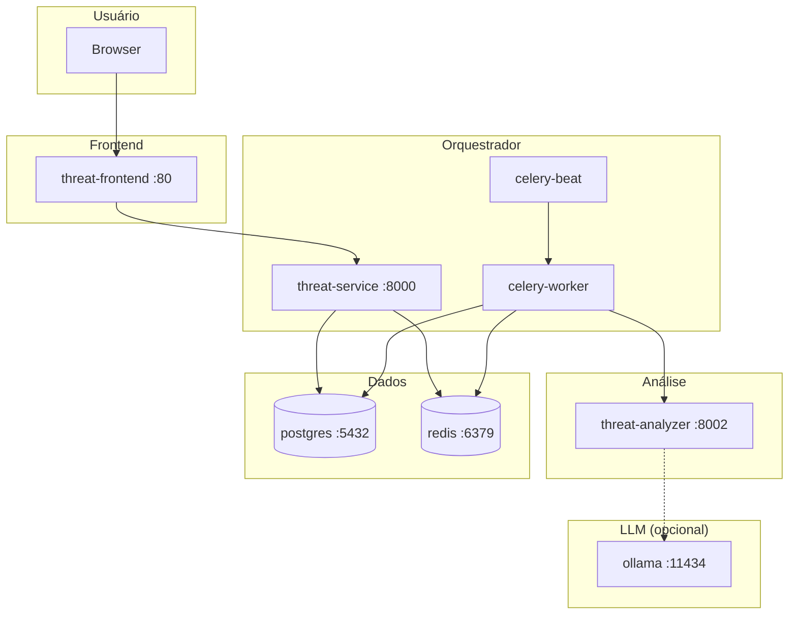

# Threat Modeling AI — Modelagem de Ameaças Automatizada

Sistema de análise de ameaças em diagramas de arquitetura usando **pipeline LLM**: extração de componentes e conexões (visão), análise STRIDE com RAG e priorização DREAD.

## Visão geral

O sistema recebe uma **imagem de diagrama** (PNG, JPEG, WebP, GIF), identifica componentes e conexões via **LLM com visão** e gera um **relatório de ameaças STRIDE** com pontuação **DREAD**, incluindo mitigações.

**Pipeline em produção (100% LLM):**

- **DiagramAgent** — LLM vision extrai componentes e conexões do diagrama.
- **StrideAgent** — Ameaças STRIDE com base de conhecimento RAG (ChromaDB).
- **DreadAgent** — Pontuação DREAD das ameaças.

**Provedores (fallback em ordem):** Gemini → OpenAI → Ollama. Validação prévia (guardrail) rejeita imagens que não forem diagramas de arquitetura.

## Escopo atual

- **Backend:** threat-analyzer (pipeline LLM STRIDE/DREAD) e threat-service (API principal, upload assíncrono, Celery, PostgreSQL).
- **Frontend:** threat-frontend — upload, listagem de análises, detalhe com polling e notificações.
- **RAG:** Base de conhecimento em `threat-analyzer/app/rag_data/` (ChromaDB).

Documentação de requisitos, design e decisões: **docs/specs/** (Spec Driven). Explicação do sistema (fluxo, pipeline, agentes, LLM, guardrail): **docs/README.md**.

## Estrutura do projeto

```
threat-modeling-ai/
├── threat-analyzer/       # Pipeline LLM (Diagram → STRIDE → DREAD), RAG
├── threat-service/        # Orquestrador: API, Celery, PostgreSQL
├── threat-frontend/       # UI React (Vite, Tailwind)
├── threat-modeling-shared/# Código compartilhado
├── configs/               # .env (não commitado; ver .env.example)
├── docs/                  # Documentação (specs + explicativo + Postman)
├── scripts/               # install_local_llm.sh, run_analysis_flow.py
└── docker-compose.yml
```

### Arquitetura (containers)

Fluxo com `make run`: o frontend consome apenas a API do threat-service; o processamento assíncrono é feito pelo Celery, que chama o threat-analyzer; o analyzer usa RAG (ChromaDB) e LLMs (Gemini, OpenAI ou Ollama).



| Serviço           | Porta  | Descrição                                              |
|-------------------|--------|--------------------------------------------------------|
| threat-frontend   | 80     | UI React; upload, listagem, detalhe, notificações     |
| threat-service    | 8000   | API REST; análises, uploads, disparo do processamento |
| threat-analyzer   | 8002   | Pipeline LLM (Diagram → STRIDE → DREAD), RAG          |
| celery-worker     | —      | Processa fila; chama threat-analyzer                   |
| celery-beat       | —      | Agendador de tarefas periódicas                        |
| postgres          | 5432   | Persistência (análises, notificações)                 |
| redis             | 6379   | Broker Celery                                          |
| ollama            | 11434  | LLM local (opcional; fallback quando configurado)      |

## Como usar

### 1. Configuração

Crie `configs/.env` a partir de `configs/.env.example` e defina credenciais dos provedores de LLM (Gemini, OpenAI) e/ou use Ollama local. **Não commite** `configs/.env`.

### 2. Setup

| Comando               | Descrição                                      |
| --------------------- | ---------------------------------------------- |
| `make setup`          | Backend + frontend                             |
| `make setup-backend`   | Apenas backend (threat-analyzer + threat-service) |
| `make setup-frontend` | Apenas frontend (`npm install` em threat-frontend) |

Para rodar a aplicação via Docker, basta `make setup-backend` e `make setup-frontend` se for build local; o uso típico é **apenas Docker** (próximo passo).

### 3. Subir a aplicação (Docker)

```bash
make run          # Stack com logs no terminal
make run-detached # Stack em background
```

Requer `configs/.env` configurado. Para usar **Ollama** local (modelos vision):

```bash
make install-local-llm   # Sobe Ollama, baixa modelos e verifica
```

### 4. Testes e lint

Os alvos de test e lint ficam nos Makefiles de cada serviço:

```bash
make -C threat-analyzer test
make -C threat-analyzer lint
make -C threat-service test
make -C threat-service lint
make -C threat-frontend lint
```

**threat-service:** os testes precisam de PostgreSQL. Crie o banco de teste (`createdb threat_modeling_test`) ou defina `TEST_DATABASE_URL`.

### 5. Teste de fluxo

Com a stack rodando (ex.: `make run`), envie uma imagem ao threat-analyzer:

```bash
make test-analysis-flow IMAGE=caminho/para/diagrama.png
```

### 6. Pre-commit

```bash
pip install pre-commit && pre-commit install
```

No commit é executado `scripts/pre_commit.sh` (lint em threat-modeling-shared e nos três serviços; testes em threat-analyzer e threat-service).

## Documentação

- **docs/README.md** — Índice da documentação (explicativo, specs, Postman).
- **docs/specs/** — Contexto, requisitos, design, ADRs, runbooks (Spec Driven).
- **docs/README.md** — Explicação unificada: fluxo de análise, ThreatModelService, módulo LLM, agentes (STRIDE, Diagram, DREAD), guardrail.
- **docs/Postman Collections/** — Coleções e ambiente para testes da API.

## Tecnologias

- **Backend:** FastAPI, Celery, Redis, PostgreSQL, LangChain, ChromaDB (RAG).
- **Frontend:** React, Vite, Tailwind, Framer Motion.
- **LLM:** Gemini, OpenAI, Ollama (vision); fallback configurável.

## Licença

MIT
