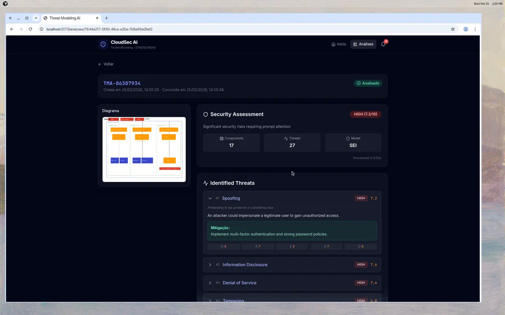
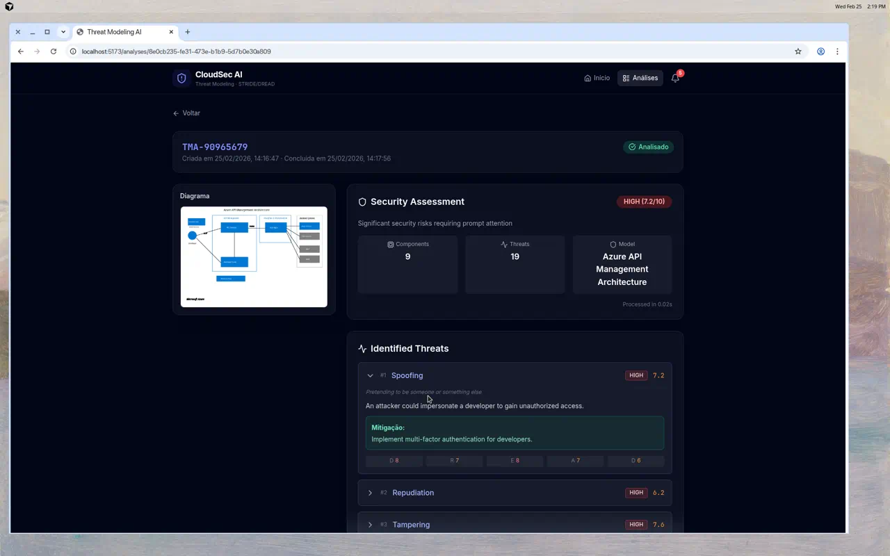

# Manual do Usuário — CloudSec AI

Guia passo a passo para usar o sistema de modelagem de ameaças.

---

## 1. Tela Inicial (Upload)

Ao acessar o sistema, a tela principal exibe a área de upload e uma descrição das tecnologias utilizadas.


**O que você pode fazer:**

- Clicar na área de upload ou arrastar uma imagem de diagrama de arquitetura (PNG, JPEG, WebP).
- Visualizar o preview do diagrama antes de enviar.
- Clicar em **"Enviar para Análise"** para iniciar o processamento.

### Upload com preview

Após selecionar um arquivo, o sistema exibe o preview e habilita o botão de envio.


---

## 2. Processamento

Ao clicar em "Enviar para Análise", o sistema:

1. Salva a imagem no servidor.
2. Cria um registro de análise com status **EM_ABERTO**.
3. Redireciona para a página de detalhe da análise.
4. O Celery worker processa a análise em background (~60–90 segundos).
5. A página atualiza automaticamente via polling quando o status muda para **ANALISADO**.

---

## 3. Lista de Análises

A página de análises exibe todas as análises realizadas em formato de grid com thumbnails.


**Cada card mostra:**

- Thumbnail do diagrama enviado
- Código da análise (ex: `TMA-86387934`)
- Status com badge colorido (Em Aberto, Processando, Analisado, Falhou)
- Data de criação
- Nível de risco (LOW, MEDIUM, HIGH, CRITICAL) com score
- Quantidade de ameaças identificadas

---

## 4. Detalhe da Análise (Resultados)

Ao clicar em uma análise concluída, a página de detalhe exibe o relatório completo.


### Security Assessment

O painel principal mostra:

- **Nível de risco** — Badge colorido (ex: HIGH 7.3/10)
- **Componentes** — Quantidade de componentes identificados no diagrama
- **Ameaças** — Total de ameaças STRIDE identificadas
- **Modelo** — Nome do modelo de arquitetura identificado

### Ameaças Identificadas (STRIDE)

Cada ameaça é listada com:

- **Categoria STRIDE** — Spoofing, Tampering, Repudiation, Information Disclosure, Denial of Service, Elevation of Privilege
- **Severidade** — Badge colorido (LOW, MEDIUM, HIGH, CRITICAL)
- **Score DREAD** — Pontuação numérica (1–10)
- **Descrição** — Explicação detalhada da vulnerabilidade
- **Mitigação** — Recomendação prática para resolver a ameaça
- **Breakdown DREAD** — Scores individuais: Damage, Reproducibility, Exploitability, Affected Users, Discoverability

### Exemplo: Ameaça CRITICAL


A ameaça acima mostra uma vulnerabilidade de **Elevation of Privilege** classificada como **CRITICAL (8.0)**, identificada em uma arquitetura Azure API Management, com mitigação específica e scores DREAD detalhados.

---

## 5. Notificações

O sistema notifica quando análises são concluídas. O ícone do sino no cabeçalho mostra a contagem de notificações não lidas.


Clique em uma notificação para ir direto à análise correspondente.

---

## 6. Exemplos de Análise

### Arquitetura AWS (SEI/SIP)

Análise completa de uma arquitetura AWS com VPC, ALB, EC2, RDS, ElastiCache e Solr distribuídos em 3 Availability Zones.



- **17 componentes** identificados
- **27 ameaças** STRIDE detectadas
- Risco **HIGH (7.3/10)**

📹 [Vídeo da análise AWS](../assets/videos/analysis-aws-architecture.mp4)

### Arquitetura Azure (API Management)

Análise de uma arquitetura Azure com API Gateway, Logic Apps, Microsoft Entra e backend services.



- **9 componentes** identificados
- **19 ameaças** STRIDE detectadas
- Risco **HIGH (7.2/10)**
- Inclui ameaça **CRITICAL** de Elevation of Privilege

📹 [Vídeo da análise Azure](../assets/videos/analysis-azure-api-management.mp4)

---

## 7. Tipos de Arquivo Aceitos

| Formato | MIME Type |
|---------|-----------|
| PNG     | image/png |
| JPEG    | image/jpeg |
| WebP    | image/webp |
| GIF     | image/gif |

**Tamanho máximo:** 10 MB

---

## 8. Pipeline de Análise

```
Imagem → Guardrail → DiagramAgent → StrideAgent → DreadAgent → Relatório
         (valida)    (componentes)   (ameaças)     (scores)
```

| Etapa | Descrição |
|-------|-----------|
| **Guardrail** | Valida se a imagem é um diagrama de arquitetura |
| **DiagramAgent** | Extrai componentes, conexões e trust boundaries via LLM Vision |
| **StrideAgent** | Identifica ameaças STRIDE com contexto RAG |
| **DreadAgent** | Pontua cada ameaça com DREAD (1–10) |

**Provedores LLM (fallback):** Gemini → OpenAI → Ollama
