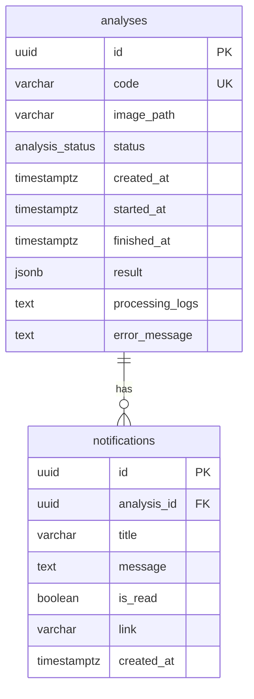

# Modelo de dados — Threat Modeling AI

Modelo de persistência do orquestrador (PostgreSQL). Definido em código em `threat-service/app/analysis/models/` e `threat-service/app/notification/models/`.

---

## Diagrama (DBML — estilo dbdiagram.io)

O esquema abaixo pode ser colado em [dbdiagram.io](https://dbdiagram.io) para visualização.

```dbml
// Threat Modeling AI — Orquestrador (PostgreSQL)
// dbdiagram.io / DBML

Enum analysis_status {
  EM_ABERTO
  PROCESSANDO
  ANALISADO
  FALHOU
}

Table analyses {
  id uuid [pk, default: `gen_random_uuid()`]
  code varchar [not null, unique]
  image_path varchar [not null]
  status analysis_status [not null, default: 'EM_ABERTO']
  created_at timestamptz [not null, default: `now()`]
  started_at timestamptz
  finished_at timestamptz
  result jsonb
  processing_logs text
  error_message text

  indexes {
    code [unique]
  }
}

Table notifications {
  id uuid [pk, default: `gen_random_uuid()`]
  analysis_id uuid [not null]
  title varchar(255) [not null]
  message text [not null]
  is_read boolean [not null, default: false]
  link varchar(500) [not null]
  created_at timestamptz [not null, default: `now()`]
}

Ref: notifications.analysis_id > analyses.id [delete: cascade]
```

---

## Descrição das tabelas

### analyses

- **id:** UUID, PK, gerado pelo backend.
- **code:** Código legível (ex.: TMA-001), único, usado na listagem e notificações.
- **image_path:** Caminho no sistema de arquivos do orquestrador onde a imagem foi salva.
- **status:** EM_ABERTO → PROCESSANDO → ANALISADO ou FALHOU.
- **created_at, started_at, finished_at:** Timestamps; started_at/finished_at preenchidos pelo worker.
- **result:** JSON do retorno do threat-analyzer (components, connections, threats, risk_score, risk_level, etc.). Preenchido quando status = ANALISADO.
- **processing_logs:** Logs de processamento (texto), opcional.
- **error_message:** Mensagem de erro quando status = FALHOU.

### notifications

- **id:** UUID, PK.
- **analysis_id:** FK para analyses; uma análise pode ter várias notificações (em geral uma por conclusão).
- **title, message:** Título e corpo da notificação.
- **is_read:** Indica se o usuário marcou como lida (POST /notifications/{id}/read).
- **link:** URL ou path para o frontend (ex.: /analyses/{id}).
- **created_at:** Data de criação.

---

## Diagrama ER (Mermaid)

Alternativa em Mermaid para visualização em Markdown:


